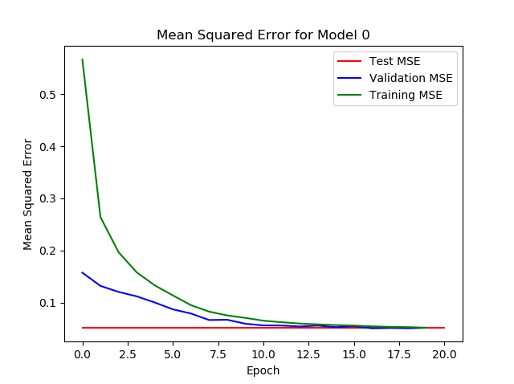
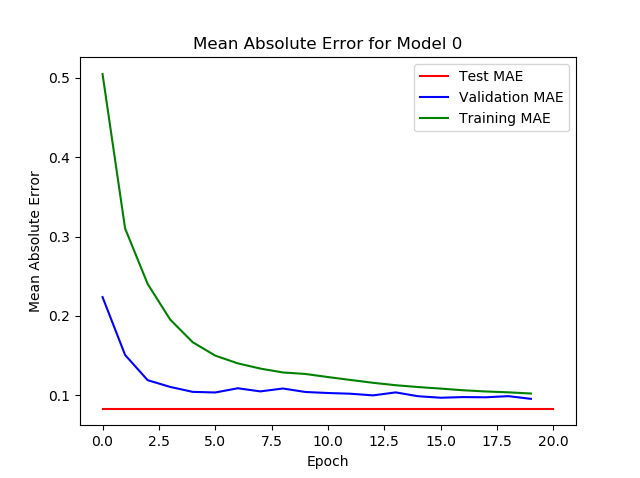
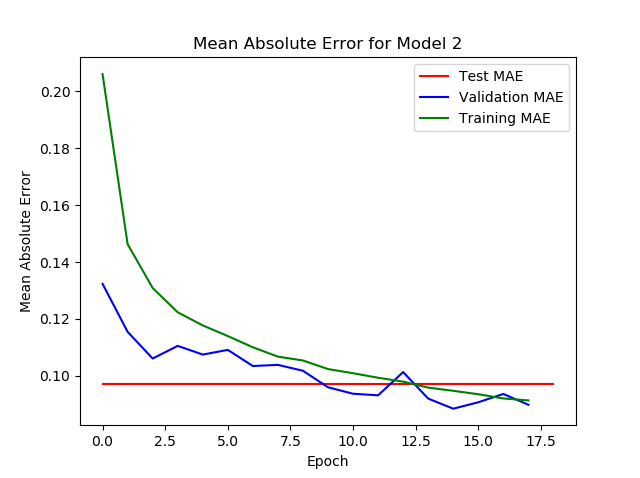
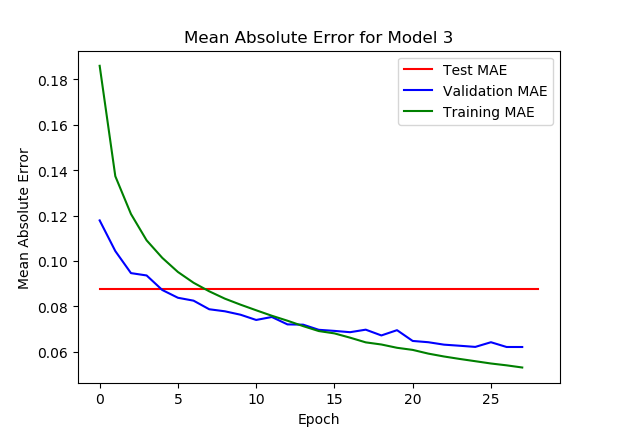
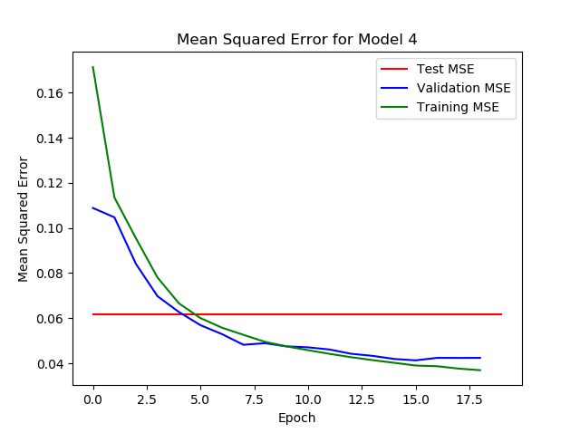
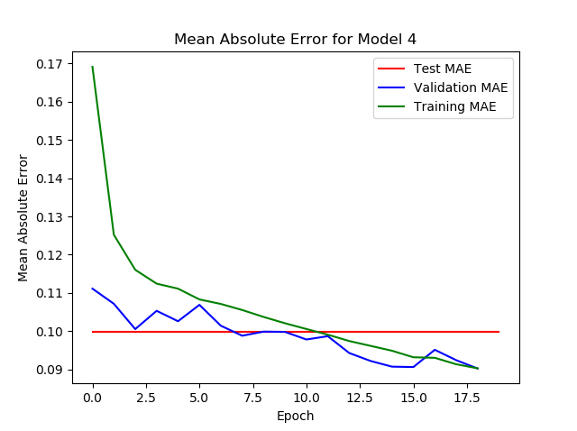
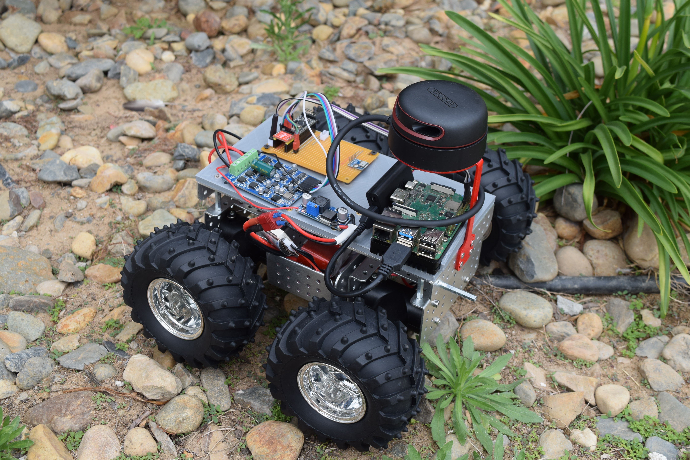
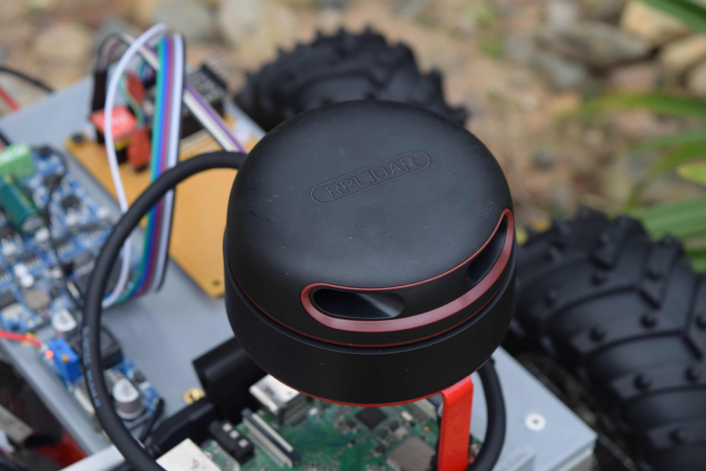

# AI Driven Rowbot

_Rowbot_ is the name of my small-scale autonomous rover project.
In this implementation of Rowbot, I have trained an end-to-end machine learning model to drive Rowbot autonomously.
In the end, this naive approach to autonomous robot motion planning surprisingly worked.
Although the rover's motion could not be directly controlled through path planning,
the rover could drive around my home's interior without hitting too many obstacles.

## What makes it autonomous?

Autonomy is achieved by equipping Rowbot with a monocular camera and 2D rangefinder.
The data from these sensors is fed directly into a machine learning (ML) model that was trained beforehand.
After processing the input data, the ML model directly outputs steering instructions.
This approach is known as end-to-end since the ML model handles everything from input through output.

## Training the Model

### Collecting Data

To train a machine learning model, one must have access to data.
To gather this data, I created a program which constantly saved data to a file.
The data being saved included a gray-scale image, an entire 360 degree range scan,
and the steering instructions that I was supplying the rover via remote control.

Here is a single formatted data point.
The entire data set is a sequence of these data points.

```
Scan, 0  # Scan counter.
Joystick X, 0  # Joystick X-coordinate.
Joystick Y, 127  # Joystick Y-coordinate.
Theta,  0, 1, 2, ..., 360  # Sequential theta readings from rangefinder.
Distance, 0, 100, 0, ...  # Distance readings corresponding to theta.
Image,  0, 0, 0, ...  # Downsized, gray-scale image. Formatted into rows and columns, accordingly.
0, 0, 0, ...
0, 0, 0, ...
```

After collecting and saving about 20 minutes of driving data, a ML model could then be trained.

### Training

Training the machine learning model required several hours of training time on a system with GTX1660 GPU and 32Gb of RAM.
To train the model, some system and Python dependencies must first be satisfied:

**System Dependencies**:

- [CUDA Toolkit ver 10.1](https://developer.nvidia.com/cuda-10.1-download-archive-base)

**Python Dependencies**

If desired, the exact development environment may be instantiated using Python version 3.7.7.
More recent versions of Python have not been tested with this project.
The exact Python packages that I used can be installed using the supplied `requirements.txt` file.

From this repository's root folder, execute the following command.

`pip install -r requirements.txt`


Alternatively, the primary packages that are used include the following:

- Scikit-Learn
- Matplotlib
- NumPy
- OpenCV

### Training Results

After training five models with different parameters, the results of each can be compared.
After visual inspection of the chosen model metrics, `model 0` was chosen to be tested on the rover.
This choice was made using various assumptions about the trained machine learning model.
Upon visual inspection of Model 0's graph, I judged that it generalized well to its training data.
This judgement was made based on Model 0's very close `Test` and `Training` metrics.


**_Note_:** Choosing the model with the "best" training results has not always yielded the best real-world results.
As a personal anecdote: I was once amazed by the performance of a particular trained model.
The arbitrary benchmarks that I had chosen as a marker of success had bested any of my previous efforts.
I was excited to allow the model to actually control the Rowbot.
As soon as I allowed Rowbot to roam on its own, it drove directly towards the closest wall.
No matter where I started the rover, it would drive towards the closest object.
Moral of the story: the following results are somewhat arbitrary.


|         Mean Squared Error          |         Mean Absolute Error         |
| :---------------------------------: | :---------------------------------: |
|  |  |
|  |  |
|  |  |
|  |  |
|  |  |


## Progress at time of Testing

This was Rowbot during the carrying out of the above tests.




